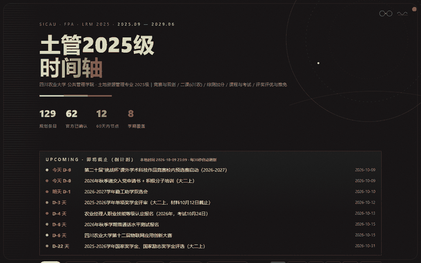
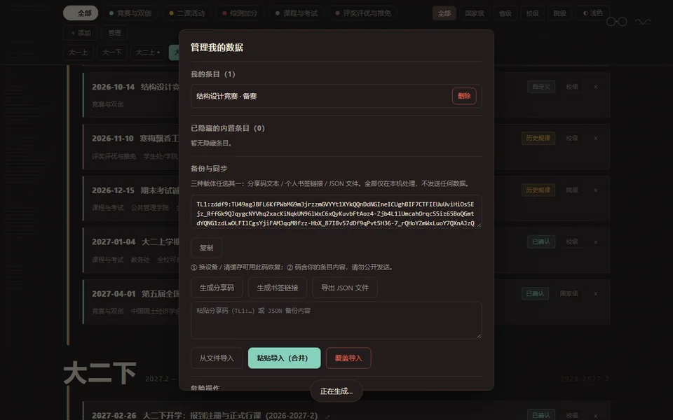
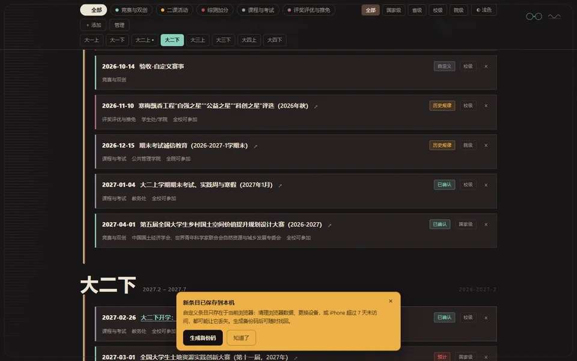
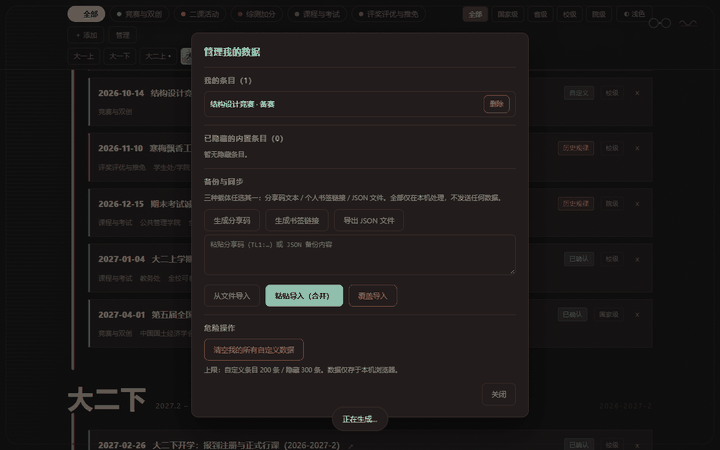
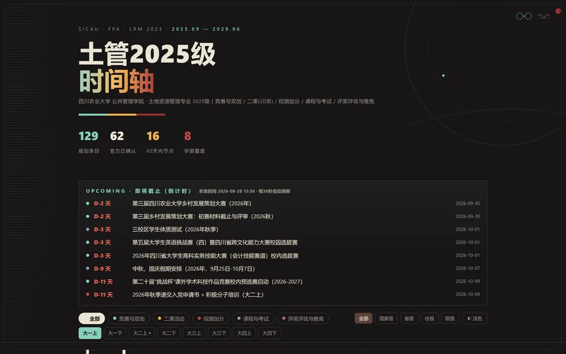
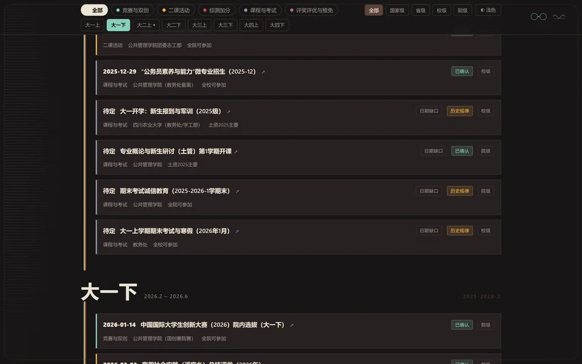
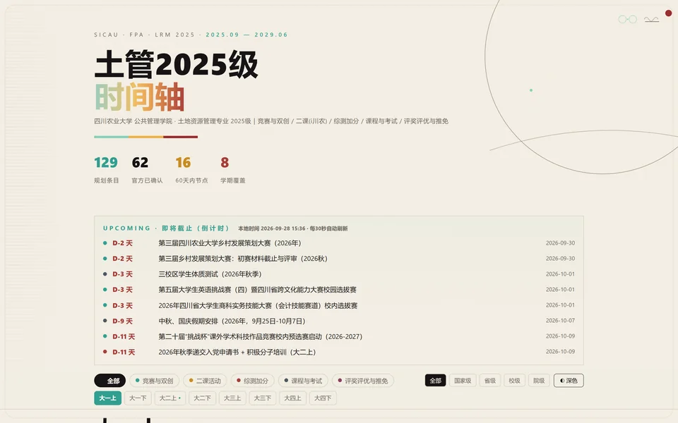
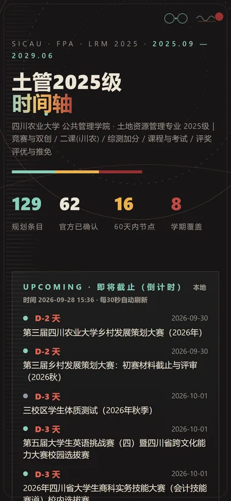
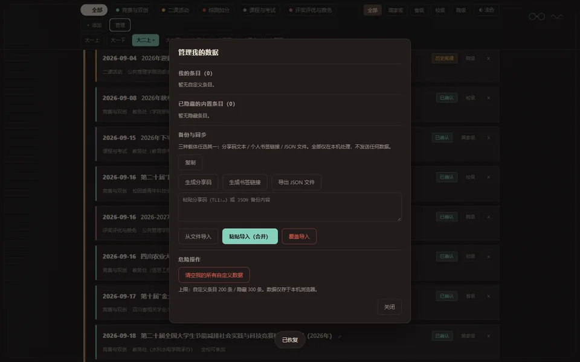
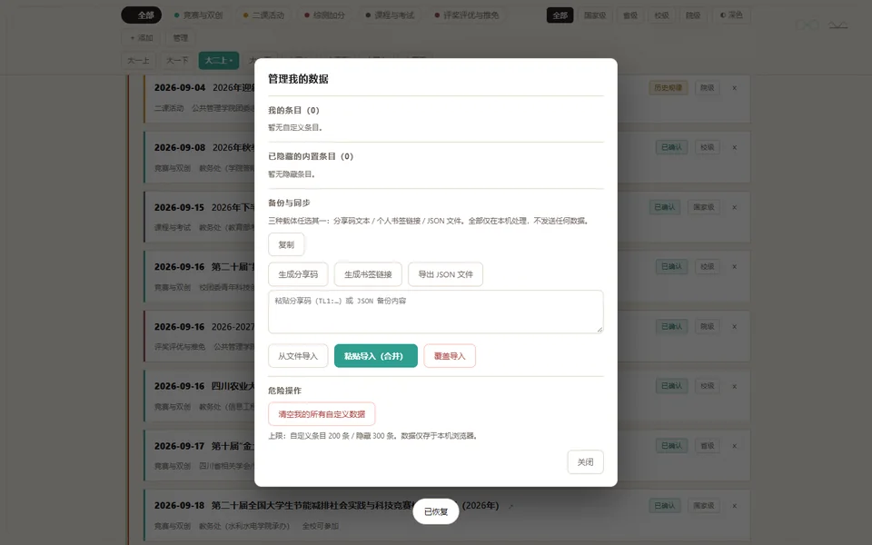

# 土管2025级 · 时间轴

四川农业大学 公共管理学院 · 土地资源管理专业 2025级（2025.9—2029.6）全周期时间轴：
**学科竞赛与双创 / 二课活动(i川农) / 综测加分 / 课程与考试 / 评奖评优与推免**五类事项，共 129 条规划事件（62 条官方已确认）。

**在线访问**
- 🟢 **国内推荐**：[sicau-timeline.pages.dev](https://sicau-timeline.pages.dev)
- GitHub Pages（海外 / 备用）：[signaljm350234-cmyk.github.io/sicau-timeline](https://signaljm350234-cmyk.github.io/sicau-timeline/)
- 部署细节：[`docs/DEPLOY_CLOUDFLARE.md`](docs/DEPLOY_CLOUDFLARE.md) · [`docs/DEPLOY_TENCENT.md`](docs/DEPLOY_TENCENT.md)

<p align="center">
  
  <br><sub>开场动画：WELCOME → 三色竖带上穿 → 落位为时间轴主脊（约 0.7s，可点击跳过）</sub>
</p>

## ✨ v1.1 新功能 · 个人条目层 / 分享码备份 / 智能定位

「＋ 添加」自己的竞赛、考试、活动……增删后统计 / 学期分组 / 筛选 / 倒计时自动同步；**数据只存在你自己的浏览器里，不上传任何服务器**。

<p align="center">
  
  <br><sub>添加条目：匀速滚动定位 → 琥珀色闪烁一次 → 底部黄色备份提醒（点「生成备份码」直达备份区）</sub>
</p>

- 🗂 **条目管理**：「管理」面板一览自定义条目；卡片 `×` 删除（自定义）或隐藏（内置条目，可随时恢复）
- 🔁 **三载体备份**（完全离线、零网络传输）：
  - **分享码** `TL1:…` —— 复制粘贴即恢复，自带校验码（截断 / 篡改会被拒绝）
  - **个人书签链接** `#u=…` —— 发给自己设备，打开即导入
  - **JSON 文件** —— 导出 / 选择文件导入，支持「合并」与「覆盖」两种模式
- 📍 **智能定位**：新条目保存后自动滚到眼前并高亮；与筛选条件冲突时自动复位
- 🛡 **安全**：所有输入转义渲染；数据仅存本机 localStorage；提示 iPhone 超过 7 天未访问有丢失风险

<table>
<tr>
<td width="50%"></td>
<td width="50%"></td>
</tr>
<tr>
<td align="center"><sub>管理面板 · 备份与同步（三载体）</sub></td>
<td align="center"><sub>添加后的黄色备份提醒</sub></td>
</tr>
</table>

<p align="center">
  
  <br><sub>分享码往返：生成 → 复制 → 粘贴导入（重复条目自动跳过）</sub>
</p>

## 📷 界面预览

<table>
<tr>
<td width="50%"></td>
<td width="50%"></td>
</tr>
<tr>
<td></td>
<td></td>
</tr>
<tr>
<td></td>
<td></td>
</tr>
</table>

## 特点

- 纯静态单页：双击 `index.html` 即可离线打开；零外部 CDN 依赖（字体本地打包、图标内联 SVG、零第三方请求）
- 开场动画：三色竖带线性上穿 → 落位为时间轴主脊（可点击跳过，`prefers-reduced-motion` 时自动跳过）
- 功能：8 学期导航（滚动跟随）、五类别 + 级别筛选、事件卡展开、**实时倒计时**（按访客本地时间每 30 秒刷新）、深浅色切换、移动端自适应（≤720px 标题移至日期下方完整显示）
- 每条事件含：时间窗口、二课/综测分值说明、官方来源链接（点击标题直达通知原文）、置信度徽标（已确认/历史规律/预计）
- **个人条目层（v1.1）**：页面内「＋ 添加 / 管理」——自定义条目、删除/隐藏/恢复；添加后自动定位 + 闪烁提示；三种纯前端备份载体（**分享码 / 个人书签链接 / JSON 文件**，支持合并/覆盖导入）；数据只存访客本机浏览器（localStorage），不上传任何服务器

## 数据口径

- `confirmed` 官方已发布 ｜ `pattern` ≥2届历史推算 ｜ `predicted` 单届/弱证据
- 全部来源为校团委 / 教务处 / 学生处 / 公共管理学院官网公开页面；政策数字以官方文件原文为准
- 2027 年及以后条目为推算（依据写在每条 `basis` 字段），建议每年 9 月 / 3 月复核更新

## 本地使用与更新

```powershell
# 本地预览（或直接双击 index.html）
python -m http.server 8000

# 更新一条事件后必须校验（0 错误才可发布）
python tools/validate_data.py

# 发布
git add -A; git commit -m "data: ..."; git push
```

详细维护步骤见 [`docs/MAINTENANCE.md`](docs/MAINTENANCE.md)；部署与回滚见 [`docs/DEPLOY.md`](docs/DEPLOY.md)。

## 目录

```
index.html  assets/（css/js/fonts/img）  data/events.js  docs/（含 images/ 截图素材）  tools/
```

## 许可与声明

- 字体：Poppins（SIL OFL）、URW Gothic（AGPL v3 + 字体嵌入例外），许可证文本在 `assets/fonts/`。
- 本页为学习辅助资料，**非学校官方发布**；政策与日期一切以学校当年度最新文件为准。
- 仓库不含任何个人信息（学号/姓名/联系方式）与第三方版权素材。
